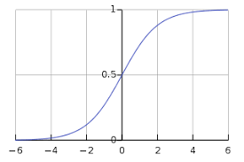
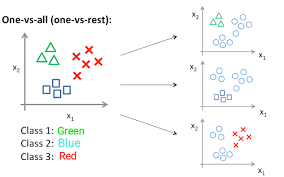

# OneVsAll-classification
using OneVsAll classification algorithm to predict handwritten digits

working of one vs all classification

to understand the working of one-vs-all classification we need to understand logistic regression

what is logistic regression ?

it is a learning algorithm used to predict values between 0 and 1 i.e logical output hence the name logistic regression.

example : predicting whether a person has a particular disease or not 
          predicting whether a car sales value will cross a particular value or not
          
logistic regression can also be used to predict something that has multi-class output
example : classification of digits using its images as input 
          finding out what company a person gets placed to given his skills and qualification etc.
          
          
 working of logisitic regression .
 
 before understanding logistic regression we need to understand something called sigmoid function.
 
 

 the image shown here is a sigmoid function . basically it converts any number between (0,1) , this function is necesary as the output we predict should be logical
 so anything >= 0.5 will be predicted as 1 else 0.
 
 for more detailed explanation of logistic regression follow the link -> https://towardsdatascience.com/logistic-regression-detailed-overview-46c4da4303bc
 
 OneVsAll
 
 one-vs-all is the same as logistic regression except that we repeat the algorithm multiple times
 
 the number of times we repeat the algorithm depends on no of multi-classes present 
 
 
 

 
